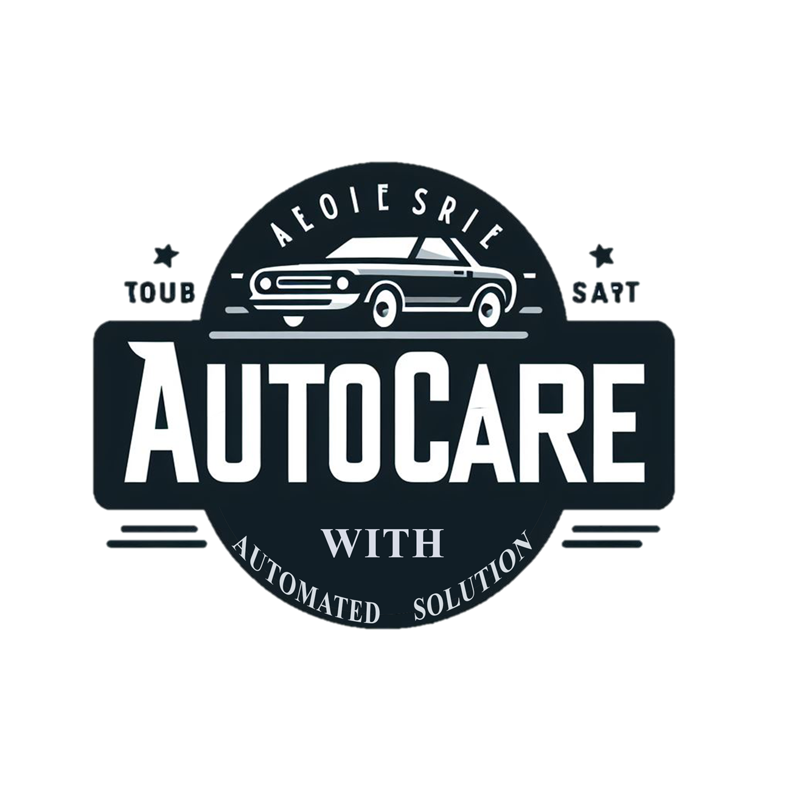

<p align="center">
  
</p>


# Auto Care Web Application

## Overview

The **Auto Care Web Application** aims to revolutionize the operations of vehicle service centers by automating and streamlining appointment scheduling, maintenance records, inventory tracking, and customer support. By leveraging cutting-edge technology, this solution will improve efficiency, reduce human error, and enhance customer satisfaction at vehicle service centers.

This web application offers a comprehensive platform for managing service appointments, vehicle maintenance records, and real-time communication between customers and service center personnel.

## Objective

The primary objective of this project is to provide a modern, automated solution that enhances the efficiency and user experience of service centers. The following key features will be implemented:

- **Appointment Booking System**: Customers can easily schedule service appointments, reducing wait times and improving operational efficiency.
- **Real-time Reporting**: Mechanics can update progress and generate invoices, and vehicle owners can instantly view performance data.
- **Inventory Management**: The system will automatically update inventory levels as parts are used during repairs or services.
- **Chatbot Integration**: An AI-powered chatbot will assist with customer inquiries and provide support.
- **Enhanced Usability**: The system will automate tasks to improve navigation and the overall user experience, leading to higher customer satisfaction.

## Technology Stack

- **UI/UX Design**: Figma
- **Frontend**: React.js
- **Backend**: Node.js with Express.js
- **Database**: MongoDB
- **APIs**: Chatbot API 

## How to Contribute

To contribute to the project, follow these steps:

### 1. Fork the Repository
- Go to the [repository](<repository-link>) and click the **Fork** button to create a personal copy of the repository in your GitHub account.

### 2. Clone Your Fork Locally
- Clone your fork to your local machine:
  ```bash
  git clone <your-forked-repository-link>
  ```

### 3. Set Up Upstream Repository
- Set up the upstream repository to keep your fork updated with the latest changes:
  ```bash
  git remote add upstream <original-repository-link>
  ```

### 4. Work on Your Changes
- Create a new branch for the feature you're working on:
  ```bash
  git checkout -b <feature-branch-name>
  ```
- Make necessary changes or add new features.

### 5. Commit Your Changes
- Stage the modified files:
  ```bash
  git add .
  ```
- Commit your changes with a clear message:
  ```bash
  git commit -m "Descriptive message of your changes"
  ```

### 6. Push Your Changes
- Push the changes to your forked repository:
  ```bash
  git push origin <feature-branch-name>
  ```

### 7. Create a Pull Request
- Open a pull request (PR) from your fork to the original repository. Provide a detailed description of the changes in your PR.

### 8. Wait for Review and Merge
- The team will review your changes and merge them into the main project once approved.

## Running the Project Locally

To run the project locally, follow these steps:

1. Clone the repository:
   ```bash
   git clone <repository-link>
   ```

2. Navigate to the project directory:
   ```bash
   cd <project-directory>
   ```

3. Install the necessary dependencies:
   ```bash
   npm install
   ```

4. Run the Frontend:
   ```bash
   npm run dev
   ```

5. Run the Backend:
   ```bash
   npm start
   ```

## License

This project is licensed under the MIT License - see the [LICENSE](LICENSE) file for details.
